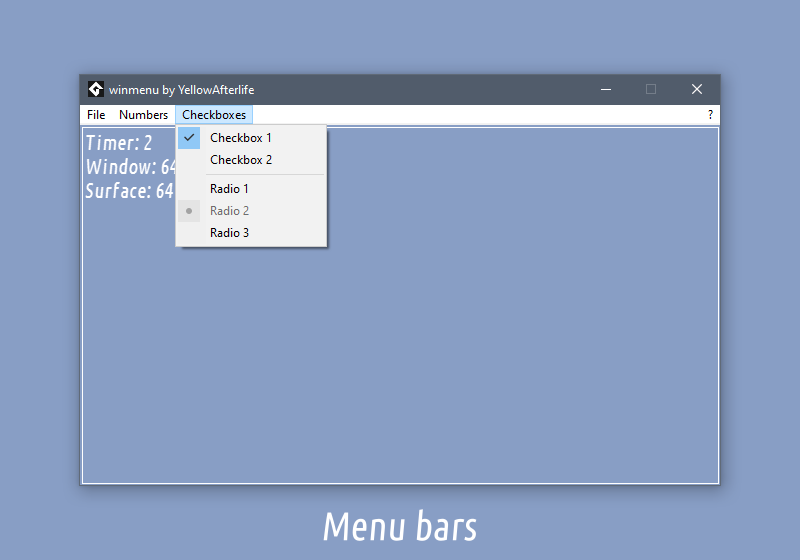
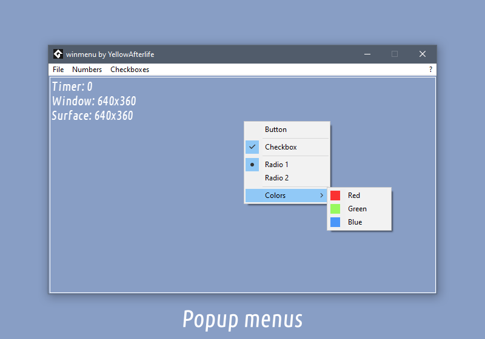
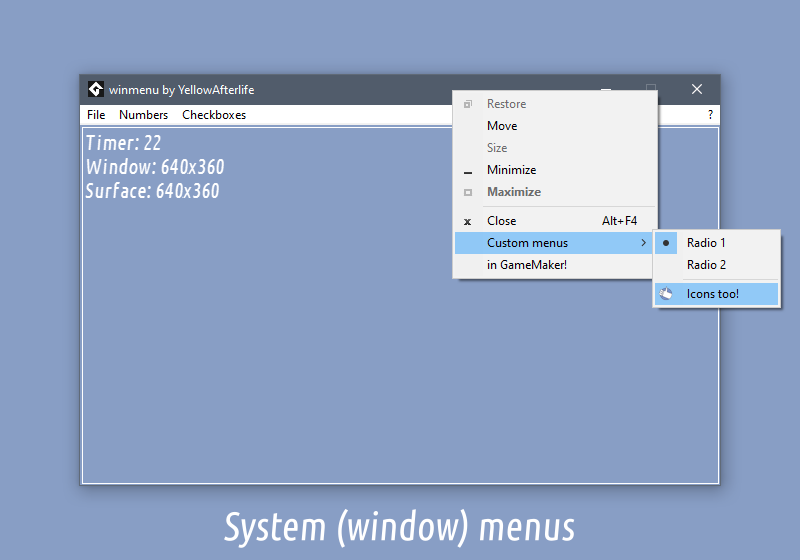
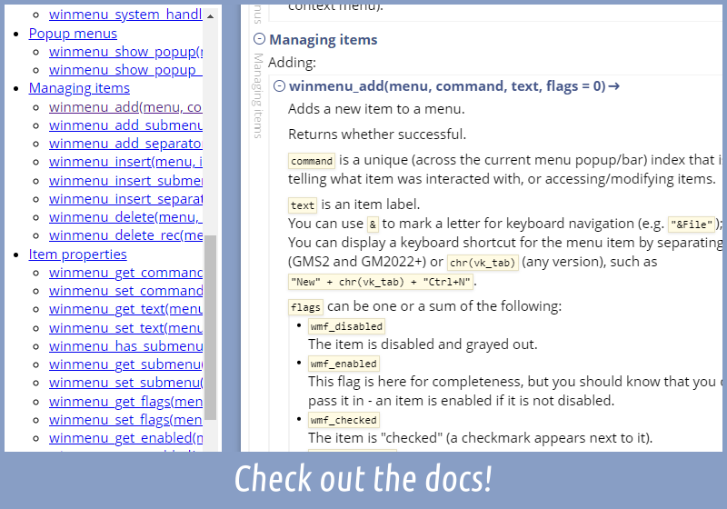

# winMenu

**Quick links:** [documentation](https://yal.cc/docs/gm/winmenu/)
· [itch.io](https://yellowafterlife.itch.io/gamemaker-winmenu)  
**Platforms:** Windows, Windows (YYC)​  
**Versions:** GameMaker 8.1, GM:Studio 1.4+, GMS 2.2+, GM2022+, GM LTS

|  |  |
| :-: | :-: |
|  |  |

winMenu is an extension for using menus in GameMaker games! That includes:

- Popup/context menus
- Menu bars
- System menus (shown when right-clicking window caption)

The extension wraps almost entirety of Windows' [Menu API](https://learn.microsoft.com/en-us/windows/win32/menurc/menus) so you can have things like

- Buttons
- Separators
- Checkboxes
- Radio buttons
- Sub-menus
- Bitmaps
- Size/position measurement and other utilities

The extension is fairly easy to use (make a menu, add items, show/assign menu)
and thoroughly documented.

## What's interesting here

Menu API essentially consists of two sets of functions:
- "Classic" functions do one thing per call and have some limitations  
  (e.g. it's not possible to add a sub-menu with an ID because the ID parameter is used for the sub-menu pointer)
- "Modern" functions do any number of things per call but are a little verbose for one-off actions  
  (you always have to make a struct, fill out flags to indicate what you're going to supply, fill out those fields, and then call the function)

Menus aren't a performance-critical API so I have designed my API
similar to the classic function set but without its known caveats.

Otherwise there's just a lot of code here!
Even with my advancements in extension-making process,
it takes hundreds upon hundreds lines of code to wrap all the functions -
especially the ones that have to go through the "modern" API.

## Building

See [BUILD.md](BUILD.md)

## Meta

**Author:** [YellowAfterlife](https://github.com/YellowAfterlife)  
**License:** Custom license (see [LICENSE](LICENSE))